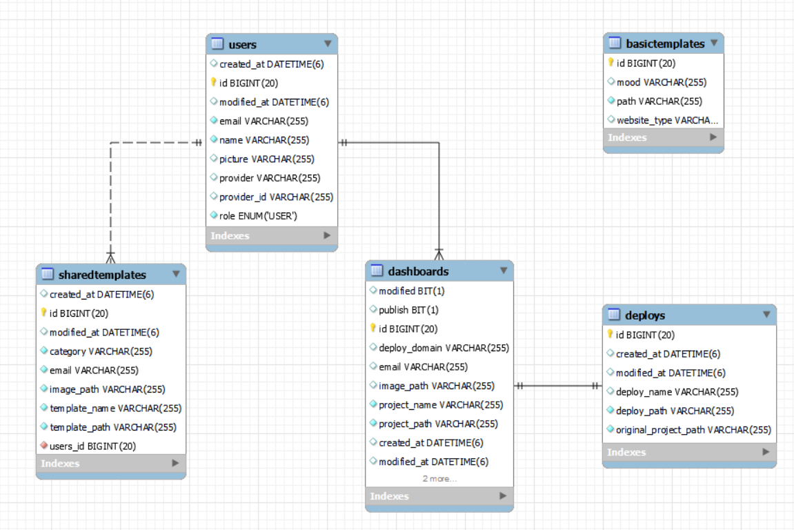

## 개요
2024년에 진행한 [생성형 AI] 인공지능을 활용한 NO-CODE 기반 웹 빌더 프로젝트(https://github.com/hanium0111) 를 Spring Framework 환경에 마이그레이션한다.
## 필요성
기존 프로젝트는 Node.js + Express.js로 구성되어 있었으나, 인터프리터 언어 특성상 런타임 중 예기치 않게 다운될 가능성이 있고, 보안 취약점이 발생할 위험이 있다. 이러한 문제를 해결하기 위해 Spring Framework 기반으로 프로젝트를 재구성한다.

## 목표
Spring Boot를 활용하여 백엔드 API를 재구성하고, 체계적인 코드 구조를 통해 확장성과 효율성을 확보한다. 또한, Spring Framework의 동작 방식을 깊이 이해하고 다양한 기능을 익혀 실력을 향상시키는 것을 목표로 한다.

## 버전
- Gradle 8.1.3
- MariaDB
- JDK 17
- java 17
- Spring Boot 3.4.4


## ERD


## 명세
| 분류           | 메소드  | URI                                              | 기능                         | RequestBody                                    | 데이터 처리                                                                 | 출력                               |
|----------------|---------|--------------------------------------------------|------------------------------|------------------------------------------------|------------------------------------------------------------------------------|------------------------------------|
| 웹사이트 생성  | POST    | /generate                                        | 사용자의 요구사항을 분석하여 웹사이트 생성 | websiteType, features, mood, content, projectName | AI 호출 및 입력 값에 따른 페이지 생성, Dashboards테이블에 저장                    | generate project successfully      |
| 대시보드       | GET     | /dashboard/my-dashboard                          | 로그인 한 사용자의 대시보드 목록       |                                                | 로그인 한 사용자의 세션의 email을 기준으로 모든 대시보드 호출                         | Email별 모든 Dashboards객체       |
| 대시보드       | PATCH   | /dashboard/{id}/update-name?newName={}           | 대시보드 프로젝트 이름 변경          | id                                             | id를 기준으로 Dashboards의 값을 name으로 수정                                       | Project name updated successfully  |
| 대시보드       | POST    | /dashboard/share                                 | 대시보드의 특정 프로젝트 공유하기     | id, templateName, category                     | id를 기준으로 Dashboards.projectPath 호출 → 절대 경로로 변경 후 공유 파일 복사 → SharedTemplates 테이블에 항목 저장 | project shared successfully        |
| 대시보드       | DELETE  | /dashboard/{id}/remove                           | 특정 대시보드 삭제하기             | id                                             | id를 기준으로 Dashboards 삭제                                                  | Dashboard deleted successfully     |
| 공유된 템플릿  | GET     | /sharedTemplate/get-all                          | 공유된 템플릿 목록 호출            |                                                | 모든 SharedTemplates 테이블을 참조하여 공유 템플릿 로드                              | 모든 SharedTemplates 객체         |
| 공유된 템플릿  | POST    | /sharedTemplate/use                              | 공유된 템플릿 사용하기            | id, projectName                                | id를 기준으로 SharedTemplates 호출 후 대시보드 복사 및 Dashboards 테이블에 항목 저장         | dashboardDTO                       |
| 공유된 템플릿  | GET     | /sharedTemplate/get-mine                         | 로그인한 사용자가 공유한 템플릿 로드 |                                                | 이메일을 기준으로 공유한 템플릿 로드                                               | 해당 SharedTemplates               |
| 공유된 템플릿  | DELETE  | /sharedTemplate/{id}/remove                      | 공유된 템플릿 삭제               | id                                             | id를 기준으로 공유된 템플릿 삭제                                                | SharedTemplate remove successfully |
| 디렉터리       | GET     | /get-structure/dir?path={}                       | 해당 디렉터리의 정보를 Json으로 제공 |                                                | 디렉터리를 재귀적으로 반복하여 파일까지 진입하여 제공                                  | 디렉터리 구조                      |
| 파일           | GET     | /get-content/file?path={}                        | 해당 파일의 내용을 제공          |                                                | 해당 파일의 내용을 제공                                                     | 파일 내용                          |
| 수정           | POST    | /modify                                          | 특정 파일을 AI로 수정           | path, prompt                                   | Path를 기준으로 파일 시스템 호출 및 AI에 Prompt하여 파일시스템 수정                     | HTML file updated successfully     |
| 배포           | POST    | /deploy                                          | 배포                          | id, deployName                                 | id를 기준으로 해당 Dashboards 경로 추출 후 배포 파일시스템 복사 및 배포 로직 적용             | Project deploy successfully        |
| 배포           | POST    | /undeploy                                        | 배포 중지                      | id                                             | id를 기준으로 배포 중지로직 적용, 배포 파일 시스템 삭제                                  | Project undeploy successfully      |
| 배포           | POST    | /update-deploy                                   | 업데이트 적용                  | id                                             | id를 기준으로 업데이트 항목 있는 경우 업데이트 적용                                | Deployment updated successfully    |


## application.property

```
spring.application.name=webBuilder
server.port=8080
server.ssl.enabled=false
server.use-forward-headers=true

#mariaDB
spring.jpa.hibernate.ddl-auto=update
spring.datasource.driver-class-name=org.mariadb.jdbc.Driver
spring.datasource.url=jdbc:mariadb://localhost:3307/web_builder
spring.datasource.username={username}
spring.datasource.password={password}

#static resource

spring.web.resources.static-locations=file:./store/,classpath:/static/


#OAuth2

google.client-id={google.client-id}
google.client-secret={google.client-secret}

#google oauth2.0 registration
spring.security.oauth2.client.registration.google.client-id=${google.client-id}
spring.security.oauth2.client.registration.google.client-secret=${google.client-secret}
spring.security.oauth2.client.registration.google.scope=profile,email

spring.security.oauth2.client.provider.google.authorization-uri=https://accounts.google.com/o/oauth2/v2/auth


#openAI key
openai.api.key={openai.api.key}

# google custom search image
google.pse.id={YOUR_PSE_ID}
google.api.key={YOUR_API_KEY}

spring.mvc.pathmatch.matching-strategy=ant_path_matcher
```

## build.gradle
```
plugins {
	id 'java'
	id 'org.springframework.boot' version '3.4.4'
	id 'io.spring.dependency-management' version '1.1.7'
}

group = 'com.project'
version = '0.0.1-SNAPSHOT'

java {
	toolchain {
		languageVersion = JavaLanguageVersion.of(17)
	}
}

repositories {
	mavenCentral()
}

dependencies {
	//필수 의존성
	implementation 'org.springframework.boot:spring-boot-starter'
	implementation 'org.springframework.boot:spring-boot-starter-web'

	//인증 의존성
	implementation 'org.springframework.boot:spring-boot-starter-oauth2-client'

	//DB의존성
	implementation 'org.springframework.boot:spring-boot-starter-data-jpa'
	runtimeOnly 'org.mariadb.jdbc:mariadb-java-client'

	//테스트 의존성
	testImplementation 'org.springframework.boot:spring-boot-starter-test'
	testRuntimeOnly 'org.junit.platform:junit-platform-launcher'

	//편리 의존성
	implementation 'org.projectlombok:lombok:1.18.24'
	annotationProcessor('org.projectlombok:lombok')

	//spring security
	implementation("org.springframework.boot:spring-boot-starter-security")
	implementation("org.springframework.security:spring-security-test")

	// selenium
	implementation 'org.seleniumhq.selenium:selenium-java:4.20.0'
	implementation 'org.seleniumhq.selenium:selenium-chrome-driver:4.20.0'
}

tasks.named('test') {
	useJUnitPlatform()
}

```


